# Prioritize

> Open-source framework for organizing companies, employees, devices (IoT), and their tasks — Spring Boot 4 / Java 21.

Prioritize models organizational structures (companies, departments, users, roles), manages documents with versioning, represents skills for people **and** devices, controls IoT resources over MQTT and REST, and organizes work as projects, tasks and goals with NFC-driven time tracking. The project is being migrated from Java EE to Spring Boot and exposes a REST API throughout, against which arbitrary clients can be built.

---

## Status

Released and production-ready — a self-hostable Spring Boot platform you can get running in one command (see [Quickstart](#quickstart)). The runnable Spring Boot core covers: company/user management, documents with versioning, skills for people and devices, resource control (MQTT/REST), telemetry state-transition rules, recurring (cron) task schedules, BPMN orchestration via Flowable, and the **project subsystem** — projects, blackboards, tasks, goal-driven progress, task time tracking, and NFC tags as physical triggers (including broadcasting scans over MQTT). A **Vaadin admin GUI** covering the org/security, resource, document, skill, scheduling and process subsystems is merged and functional. Some concepts from the original framework (action board, message inbox) are planned but not yet ported.

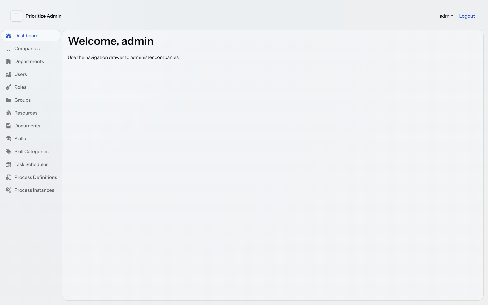

---

## Technology stack

| Area | Technology |
|---|---|
| Runtime | Java 21 |
| Framework | Spring Boot 4.0.5 (Web, Data JPA, Security, Integration) |
| Persistence | PostgreSQL (production), H2 (local/tests) |
| Authentication | HTTP Basic Auth **or** OAuth2 Resource Server (Keycloak, JWT) |
| IoT transport | MQTT (Spring Integration + Eclipse Paho v3) and REST |
| Process engine | Flowable (BPMN) |
| Admin GUI | Vaadin 25 (Flow) |
| Document parsing | Apache Tika |
| API docs | springdoc-openapi (Swagger UI) |
| Build | Maven |
| Boilerplate | Lombok |

---

## Architecture

### Layers

The application follows a clear layering with a fixed convention for authorization:

- **Controllers** accept `Authentication`, resolve the `PUser` from it, and pass it **explicitly** to the service layer. Controllers contain no authorization logic.
- **Services** hold all business logic **including authorization**. Permission checks happen exclusively here and are enforced via exceptions (not via return values).
- **Repositories** (Spring Data JPA) encapsulate data access.

Further conventions: constructor injection via Lombok `@RequiredArgsConstructor`; IDs consistently typed as `Long`; `CurrentUserResolver` as the central bridge between Spring Security's `Authentication` and the `PUser` model.

### Resource control (hexagonal)

Control of IoT resources is modeled as a hexagonal port. The rest of the system only knows the `ResourceControlAdapter` interface, not the concrete transport:

- **REST** (`RestResourceControlAdapter`) is the always-active base transport. Any resource with an IP set is controllable via REST (`POST http://<ip>:<port>/command`).
- **MQTT** (`MqttResourceControlAdapter`) is an optional, additional capability. The entire MQTT branch is active only when `prioritize.mqtt.enabled=true` (`@ConditionalOnProperty`); otherwise it stays dormant.

The `ResourceControlService` selects the transport per command following a capability-set strategy with fallback:

1. MQTT capability present **and** online → MQTT
2. MQTT capability present but offline + REST endpoint (IP) set → REST fallback
3. No MQTT capability → REST
4. No reachable transport → `ResourceOfflineException` (HTTP 503)

The inbound and outbound directions are deliberately separated: outbound commands go through the port; inbound device events (status, discovery, telemetry) are handled by a separate inbound path (`InboundResourceEventHandler`). The wire format is JSON (`ResourceCommandMessage` with `command` / `param` / `slot`).

### Slot-bound control via reservations

Resources can have multiple **slots** (`maxSlots`). A control command always addresses a specific slot — this slot is **not supplied by the client** but derived server-side from the calling user's active reservation:

- Exactly one active reservation by the user → its slot is used.
- No active reservation → `SlotNotReservedException` (HTTP 409). A command requires an ongoing reservation.
- Multiple active reservations → slot is ambiguous → `SlotNotReservedException` (HTTP 409).

"Active" means the current point in time lies within the reserved window (`dateFrom <= now < dateUntil`). An expired reservation implicitly releases the slot; a command sent afterwards runs into the 409 case.

### Projects, tasks and goal-driven progress

Projects own a **blackboard** carrying **tasks**. Authorization in this subsystem is **membership-based** (project manager or member), orthogonal to the role/permission system used elsewhere; a task's assignee/manager is a `PActor` (either a `PUser` or a `Resource`). Progress is **goal-driven, not task-driven**: a `Task` carries no percentage, only an optional link to a `ProjectGoal`. A goal's completion is the share of its non-cancelled tasks that reached a done status; a project's progress is the average over its counting goals, and `null` (n/a) when undefined. Progress is always **computed, never stored**.

### Task time tracking and NFC

Time tracking lives on the `Task` (a running span plus a history of completed spans), so it works **with or without** NFC. `GET /tasks/{id}/tracking` returns the aggregated total (the running span counted live up to now); `GET /tasks/{id}/tracking/sessions` lists the individual work sessions.

An `NfcUnit` is a physical NFC tag mounted on a resource (a resource may carry several tags of different types: `COUNTER`, `CHECKPOINT`, `TIMETRACKER`, `INFOPOINT`, `OTHER`). Scanning a tag resolves it by UUID and triggers a type-specific action — a `TIMETRACKER` tag toggles the time tracking of the single task it is bound to. When the MQTT profile is active, each scan is additionally **broadcast** on the topic `nfc/scan/<tag-uuid>` so devices and dashboards can observe it live; without MQTT, scanning works unchanged.

### Telemetry state-transition rules

A resource can carry **telemetry rules** that turn a stream of numeric readings into a persisted `OK`/`ALARM` state. A rule defines an operator (`GT`, `LT`, `RANGE`), one or two thresholds, a `hysteresis` dead-band, and a `severity`. Both ingest paths (REST `POST /resources/{id}/values` and MQTT) evaluate the resource's enabled rules after each save; the breach uses the raw threshold, the clear only triggers once the value crosses back past threshold ± hysteresis (edge logic, so a value hovering at the boundary does not flap). On a state change the rule is persisted and a `TelemetryThresholdEvent` is fired; with the MQTT profile a `telemetry/alarm/<resourceId>` message is broadcast (`type: "TELEMETRY_ALARM"`). Resources without any rule cost zero extra database work (an in-memory guard is checked before any query).

### Recurring task schedules

A `TaskSchedule` fires a task template onto a project's blackboard on a cron cadence. Each schedule carries the target project, the task template (name/description/priority), a `cronExpression`, a `zoneId`, an `enabled` flag, and `nextFireAt`/`lastFiredAt`. A gated poller (`@Scheduled`, enabled by default, disable with `prioritize.scheduling.enabled=false`) runs due schedules through a trusted user-less create path, stamps `lastFiredAt`, and advances `nextFireAt`. The cron is evaluated in the schedule's own zone but `nextFireAt` is stored normalized to the server zone, so the poller compares every schedule against a single wall clock. Failures are isolated per schedule.

### BPMN orchestration (Flowable)

Flowable is used for **orchestration, not lifecycle ownership**: it describes order, waiting and responsibility, never computation. BPMN definitions are managed as versioned documents that require an **explicit activation** step before they can run (the classpath stays as a trusted root/break-glass source). Running processes link generically to a project or task (business key `project:<id>` / `task:<id>`). Two bridges connect processes to the platform: an **inbound trusted facade** (`PlatformGateway`) lets a process create tasks, store documents or control resources under a seeded system principal, and an **outbound event bridge** wakes waiting processes from platform events (NFC scans, telemetry thresholds) correlated by a single rule — the pair of message name and an `awaitedResourceId` process variable.

---

## Configuration (profiles)

Behavior is controlled via Spring profiles. The default profile is `h2` (see `application.yaml`), so a fresh checkout runs with no external setup.

| Profile | Purpose |
|---|---|
| `h2` | Local H2 file database including H2 console at `/h2-console`. **Default.** |
| `postgres` | PostgreSQL data source (shared/production/NAS setup). |
| `keycloak` | Switches security from Basic Auth to OAuth2 Resource Server (JWT). |
| `mqtt` | Enables the MQTT transport (`prioritize.mqtt.enabled=true`). |

Profiles are combinable, e.g. `spring.profiles.active=postgres,keycloak,mqtt`.

### Authentication

The security configuration is profile-dependent and mutually exclusive:

- **Without** the `keycloak` profile, `SecurityConfig` (`@Profile("!keycloak")`) applies with **HTTP Basic Auth** for the REST API plus **form login** for the admin GUI.
- **With** the `keycloak` profile, `KeycloakSecurityConfig` (`@Profile("keycloak")`) applies as an **OAuth2 Resource Server** (JWT / Bearer). The `issuer-uri` is set in `application-keycloak.yaml`; it must exactly match the `iss` claim of the tokens.

> **Bearer auth is a REST-API story only.** Under the `keycloak` profile the app is a pure resource server with no login page — the Vaadin admin GUI is **not** reachable (every browser page returns `401`, because the browser sends no `Authorization: Bearer` header). Use the admin GUI without the `keycloak` profile (Basic/form login); use Keycloak/Bearer tokens against `/api/v1/**`. Running the GUI under Keycloak (OAuth2 login + JIT user provisioning) is a planned post-1.0 feature.

A default administrator (`admin` / `p@ssword`) is seeded on first start by `InitializationService` (BCrypt-hashed in the database). Change it before any non-local deployment.

### Database credentials

The PostgreSQL data source reads its password from the `DB_PASSWORD` environment variable, defaulting to `prioritize` for local development (see `application-postgres.yaml`). Set `DB_PASSWORD` in any shared or production environment.

### MQTT

Bound to the prefix `prioritize.mqtt` (`MqttProperties`):

```yaml
prioritize:
  mqtt:
    enabled: true
    broker-url: tcp://memoryalpha:1883   # TLS later: ssl://...:8883
    client-id: prioritize-backend
    # username: prioritize
    # password: ${MQTT_PASSWORD:}
    qos: 1
    subscribe-topics:
      - DISCOVERY
      - "+/status"
```

---

## Quickstart

The fastest way to try Prioritize is Docker. You can also run it from source with a JDK.

### With Docker (recommended for self-hosting)

Requires Docker with the Compose plugin. This builds the app image and starts it together with a PostgreSQL database:

```bash
docker compose up --build
```

Then open **http://localhost:8080** and log in with `admin` / `p@ssword`. The REST API lives under `/api/v1` and Swagger UI is at `/swagger-ui.html`.

Just want a quick look with no database to manage? A single self-contained container backed by an embedded H2 file DB is enough:

```bash
docker build -t prioritize .
docker run --rm -p 8080:8080 prioritize
```

The optional stacks are opt-in via Compose profiles (copy `.env.example` to `.env` and add the profile to `SPRING_PROFILES_ACTIVE`, e.g. `postgres,mqtt`):

```bash
docker compose --profile mqtt up        # + Mosquitto broker (device telemetry / NFC)
docker compose --profile keycloak up    # + Keycloak (OIDC bearer-token auth)
```

Data persists in the `db-data` volume (PostgreSQL) or the container's `/app/data` volume (H2). Stop with `docker compose down` to keep the data, or `docker compose down -v` to drop it.

### From source (JDK 21 + Maven)

Prerequisites: JDK 21 and Maven. No database setup is needed for the default `h2` profile.

```bash
# Default: local H2 file DB, no external services (just run it)
mvn spring-boot:run

# Against a shared/production PostgreSQL
mvn spring-boot:run -Dspring-boot.run.profiles=postgres

# PostgreSQL with Keycloak and MQTT
mvn spring-boot:run -Dspring-boot.run.profiles=postgres,keycloak,mqtt
```

Tests:

```bash
mvn test
```

With the `h2` profile, the H2 console is available at `http://localhost:8080/h2-console`.

### API documentation

While the application is running, interactive OpenAPI documentation is served via springdoc (Swagger UI, typically at `/swagger-ui.html`). The `basicAuth` and `bearerAuth` security schemes are registered, so endpoints can be tested authenticated directly from the UI.

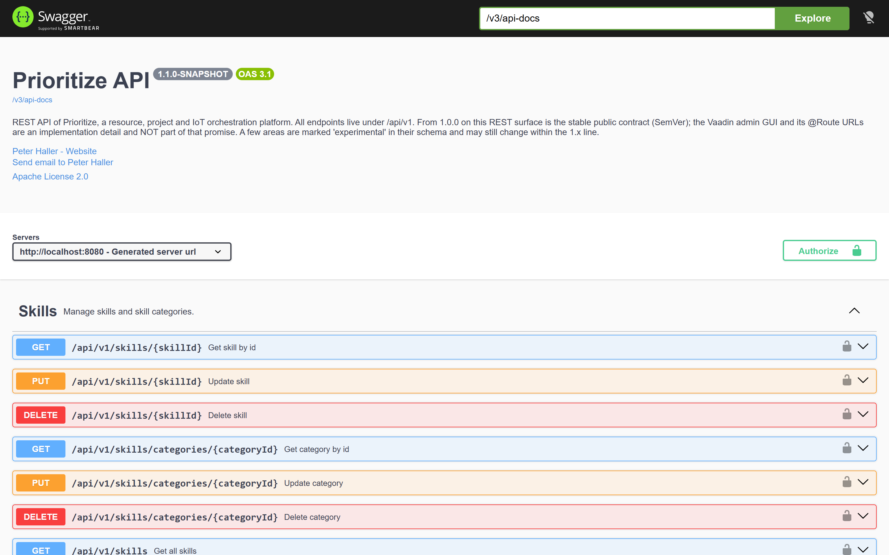

---

## Admin GUI (Vaadin)

A Vaadin admin GUI ships in-process and is served from the application root (`http://localhost:8080/`). Log in with a local user (default `admin` / `p@ssword`); it uses form login and is available only **without** the `keycloak` profile (see [Authentication](#authentication)). It is an operator tool for the platform, not the primary API — arbitrary clients are expected to build on the REST API instead.

Covered subsystems (one navigation entry each): Dashboard, Companies, Departments, Users, Roles, Groups, Resources (with live online status and reservations), Documents (list/download/delete), Skills, Skill Categories, Task Schedules, Process Definitions, and Process Instances. GUI routes are an implementation detail and are **not** part of the public API contract (see [API stability](#api-stability)).

<details>
<summary><h3>📸&nbsp; Screenshots &nbsp;<sub>(click to expand)</sub></h3></summary>

Resources — networked machines and sensors with live online-status indicators:

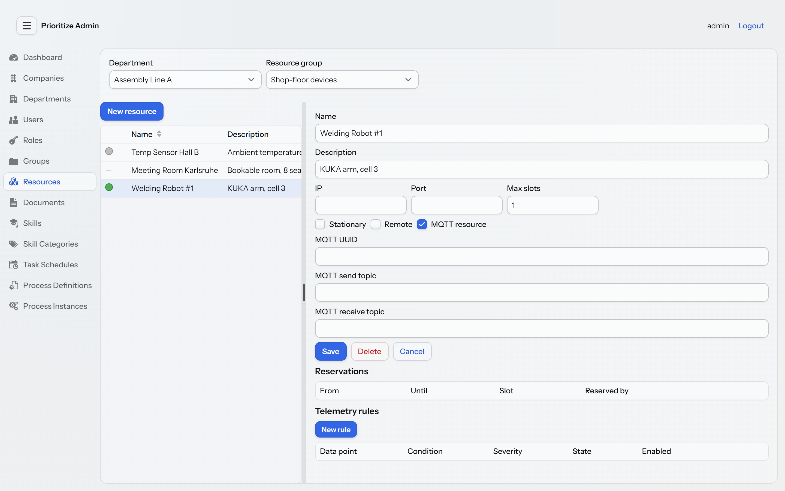

Users — org-wide user administration:

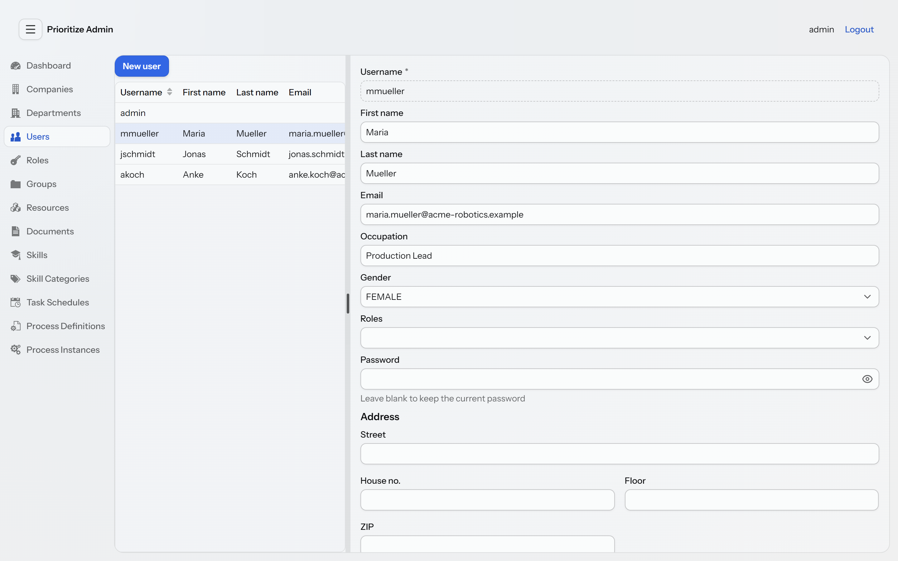

Skills — competencies for people and devices:

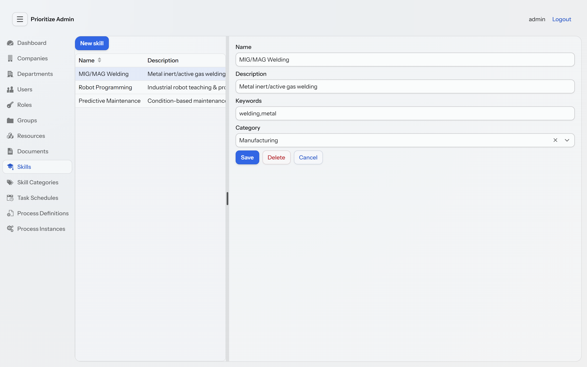

Login:

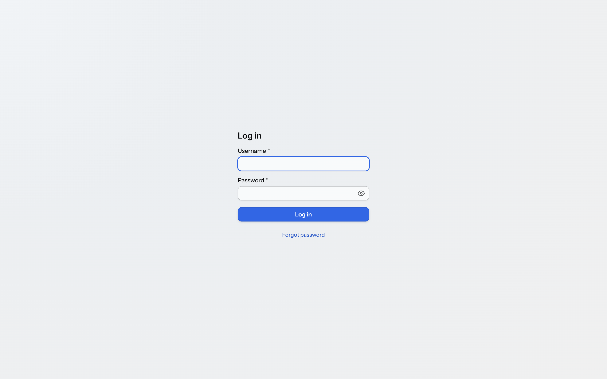

</details>

---

## REST API (overview)

All core endpoints live under `/api/v1`. The table below is an overview, not a complete reference — the authoritative, always-current description is provided by the OpenAPI docs.

### Resources & control

| Method | Path | Purpose |
|---|---|---|
| `GET` | `/api/v1/resourcegroups/{groupId}/resources` | Resources of a group |
| `POST` | `/api/v1/resourcegroups/{groupId}/resources` | Create resource |
| `GET` | `/api/v1/resources/{id}` | Get resource |
| `PATCH` | `/api/v1/resources/{id}` | Partial update (null = unchanged) |
| `DELETE` | `/api/v1/resources/{id}` | Delete resource |
| `POST` | `/api/v1/resources/{id}/command` | Send control command (slot derived from reservation) |
| `POST` | `/api/v1/resources/{id}/reserve` | Reserve resource for a time window |
| `GET` | `/api/v1/resources/{id}/reservations` | All reservations of the resource |
| `GET` | `/api/v1/resources/{id}/reservations/mine` | Own active reservations (slot preview) |
| `DELETE` | `/api/v1/reservations/{reservationId}` | Cancel reservation / release slot |
| `POST` | `/api/v1/resources/{id}/values` | Ingest a telemetry reading |
| `GET` | `/api/v1/resources/{resourceId}/skills` | Skills of a resource |
| `POST` | `/api/v1/resources/{resourceId}/skills` | Assign skill |

### Projects, tasks & goals

| Method | Path | Purpose |
|---|---|---|
| `POST` | `/api/v1/projects` | Create project |
| `GET` | `/api/v1/projects/mine` | Projects I manage or am a member of |
| `GET` / `PUT` / `DELETE` | `/api/v1/projects/{id}` | Get / update / delete project |
| `POST` / `DELETE` | `/api/v1/projects/{id}/members` | Add / remove member |
| `GET` | `/api/v1/projects/{id}/tasks` | Tasks on the project's blackboard |
| `GET` / `POST` | `/api/v1/projects/{id}/goals` | List / create goals |
| `GET` | `/api/v1/projects/{id}/progress` | Computed goal-driven progress |
| `POST` | `/api/v1/projects/{projectId}/tasks` | Create task |
| `GET` / `PUT` / `DELETE` | `/api/v1/tasks/{id}` | Get / update / delete task |
| `POST` | `/api/v1/tasks/{id}/assign` | Assign a `PActor` |
| `PUT` | `/api/v1/tasks/{id}/status` | Change task status |
| `PUT` / `DELETE` | `/api/v1/tasks/{id}/goal` | Assign / unassign a goal |

### Time tracking & NFC

| Method | Path | Purpose |
|---|---|---|
| `POST` | `/api/v1/tasks/{id}/tracking/{start\|stop\|toggle}` | Start / stop / toggle time tracking |
| `GET` | `/api/v1/tasks/{id}/tracking` | Aggregated tracked total (running span live) |
| `GET` | `/api/v1/tasks/{id}/tracking/sessions` | Individual tracked work sessions |
| `GET` / `POST` | `/api/v1/resources/{id}/nfc-units` | List / register NFC tags on a resource |
| `PUT` / `DELETE` | `/api/v1/nfc-units/{id}/task/{taskId}` | Bind / unbind a `TIMETRACKER` tag to a task |
| `POST` | `/api/v1/nfc/scan/{uuid}` | Process a tag scan (type-specific action) |

### Companies & departments

| Method | Path | Purpose |
|---|---|---|
| `GET` | `/api/v1/companies/{id}` | Get company |
| `POST` | `/api/v1/companies/filter` | Filter companies |
| `PUT` | `/api/v1/companies/{id}` | Update company |
| `DELETE` | `/api/v1/companies/{id}` | Delete company |
| `POST` | `/api/v1/companies/{companyId}/departments` | Create department |
| `GET` | `/api/v1/companies/{companyId}/departments` | Departments of a company |
| `GET` | `/api/v1/departments/{id}` | Get department |
| `PUT` | `/api/v1/departments/{id}` | Update department |
| `DELETE` | `/api/v1/departments/{id}` | Delete department |

### Users

| Method | Path | Purpose |
|---|---|---|
| `GET` | `/api/v1/users/{id}` | Get user |
| `PUT` | `/api/v1/users/{id}` | Update user |
| `PATCH` | `/api/v1/users/{id}` | Partial update |
| `DELETE` | `/api/v1/users/{id}` | Delete user |
| `GET` | `/api/v1/users/{userId}/skills` | Skills of a user |
| `POST` | `/api/v1/users/{userId}/skills` | Assign skill |

### Skills

| Method | Path | Purpose |
|---|---|---|
| `GET` / `POST` | `/api/v1/skills` | List / create skills |
| `GET` / `PUT` / `DELETE` | `/api/v1/skills/{skillId}` | Get / update / delete skill |
| `GET` / `POST` | `/api/v1/skills/categories` | List / create categories |
| `GET` / `PUT` / `DELETE` | `/api/v1/skills/categories/{categoryId}` | Get / update / delete category |

### Documents

| Method | Path | Purpose |
|---|---|---|
| `GET` | `/api/v1/documents/download/{documentInfoId}` | Download document |
| `GET` | `/api/v1/documents/{id}/version/{versionNumber}` | Get a specific version |
| `GET` | `/api/v1/documents/{id}/history` | Version history |
| `POST` | `/api/v1/documents/{id}/check-out` | Check out (lock) |
| `POST` | `/api/v1/documents/{id}/check-in` | Check in (new version) |
| `POST` | `/api/v1/documents/{id}/cancel-check-out` | Cancel check-out |
| `GET` | `/api/v1/documents/search` | Full-text / metadata search |
| `GET` | `/api/v1/documents/recent` | Recently changed documents |
| `DELETE` | `/api/v1/documents/{id}` | Delete document |
| `GET` | `/api/v1/document-groups/{groupId}/documents` | Documents of a group |
| `DELETE` | `/api/v1/document-groups/{groupId}` | Delete group |

### Telemetry rules

| Method | Path | Purpose |
|---|---|---|
| `GET` / `POST` | `/api/v1/resources/{resourceId}/telemetry-rules` | List / create rules for a resource |
| `GET` / `PATCH` / `DELETE` | `/api/v1/telemetry-rules/{id}` | Get / update / delete a rule |

### Task schedules

| Method | Path | Purpose |
|---|---|---|
| `GET` / `POST` | `/api/v1/projects/{projectId}/task-schedules` | List / create schedules for a project |
| `GET` / `PATCH` / `DELETE` | `/api/v1/task-schedules/{id}` | Get / update / delete a schedule |

### Processes (Flowable)

| Method | Path | Purpose |
|---|---|---|
| `GET` | `/api/v1/process-definitions` | List registered process definitions |
| `POST` | `/api/v1/documents/{documentInfoId}/process-definition` | Register a BPMN document as a definition |
| `GET` | `/api/v1/process-definitions/{id}` | Get a definition |
| `POST` | `/api/v1/process-definitions/{id}/activate` | Activate (deploy to the engine) |
| `POST` | `/api/v1/process-definitions/{id}/deactivate` | Deactivate |
| `DELETE` | `/api/v1/process-definitions/{id}` | Remove a definition (`?force=true` to also drop a deployment) |
| `GET` / `POST` | `/api/v1/projects/{projectId}/process-instances` | List / start instances linked to a project |
| `POST` | `/api/v1/tasks/{taskId}/process-instances` | Start an instance linked to a task |
| `GET` | `/api/v1/tasks/{taskId}/process-instance` | The instance linked to a task |
| `GET` | `/api/v1/process-instances/{id}` | Get an instance |
| `POST` | `/api/v1/process-instances/{id}/cancel` | Cancel an instance (manager only) |

---

## API stability

From `1.0.0` onward the project follows [semantic versioning](https://semver.org/): the version number communicates what a consumer can rely on.

- **The REST API under `/api/v1` is the stable contract.** These endpoints — their paths, methods, request/response shapes and documented status codes — are the public surface that external clients build against. Backward-incompatible changes to them will not happen within the `1.x` line; they would come with a new major version (and, where practical, a new path prefix such as `/api/v2`). Additive changes (new endpoints, new optional fields) are minor releases and are safe to adopt. The authoritative, always-current description is the OpenAPI document served by the running application (see [API documentation](#api-documentation)); the tables above are only an overview.

- **The Vaadin admin GUI and its routes are an implementation detail — not part of the contract.** The `@Route` URLs (`/process-definitions`, `/task-schedules`, …) exist for the browser UI and may change at any time without a major bump. Do not script or link against them; drive automation through `/api/v1` instead.

- **`SkillProperty` is experimental.** The skill *property* model (typed key/value attributes on a skill) is exposed for early feedback and is marked `EXPERIMENTAL` in the OpenAPI schema. It has no admin GUI yet and its shape may change in a minor release without the usual stability guarantee. Everything else in the skill subsystem (skills, categories, assignments) is stable.

- **`POST /api/v1/users` creates users without a password, by design.** In production the identity provider (Keycloak) owns credentials, so the local account is provisioned password-less; `PUser.password` carries `@JsonIgnore` and is never accepted or returned over REST. A REST-created user therefore cannot log in via Basic auth — that is intended for the Keycloak deployment model, not a missing feature. To create a login-capable local user (for a Basic-auth / development setup), use the admin GUI's user view, which has a password field. Just-in-time provisioning of local users on first Keycloak login is a planned post-1.0 addition.

---

## Error semantics (HTTP status)

Centralized in `GlobalExceptionHandler`:

| Status | Trigger |
|---|---|
| `400 Bad Request` | `IllegalArgumentException` (e.g. invalid date format, end before start date); `HttpMessageNotReadableException` (malformed / unreadable request body) |
| `403 Forbidden` | `AccessDeniedException` (missing permission) |
| `404 Not Found` | `NoSuchElementException` / `EntityNotFoundException` |
| `409 Conflict` | `IllegalStateException`, `SlotNotReservedException` (no / ambiguous active reservation), `SlotOccupiedException` (slot already taken), `DataIntegrityViolationException` (constraint violation) |
| `500 Internal Server Error` | `IncorrectResultSizeDataAccessException` and any otherwise unmapped exception |
| `502 Bad Gateway` | `ResourceCommandFailedException` (device rejected the command) |
| `503 Service Unavailable` | `ResourceOfflineException` (no reachable control channel) |

---

## Domain model (brief overview)

- **Company / Department** — organizational base structure. The hierarchy provides a foundation for tenant separation, but enforced multi-tenant isolation is not yet implemented (projects are membership-scoped, `admin` is a global superuser).
- **PUser / Role / PermissionRecord** — users, roles, and the fine-grained permission model.
- **Resource** — a device / resource; can represent an IoT device and communicate externally (REST/MQTT). Has slots and reservations.
- **ResourceReservation** — time-bound occupancy of a resource slot by a user.
- **Document / DocumentInfo / DocumentGroup** — documents with versioning and check-in/check-out.
- **Skill / SkillCategory / SkillRecord** — capabilities; assignable to users **and** resources.
- **Project / Blackboard / Task / ProjectGoal** — projects own a blackboard of tasks; goals drive computed progress; a task's assignee/manager is a `PActor`.
- **NfcUnit** — a physical NFC tag mounted on a resource; a scan triggers a type-specific action (e.g. toggling a task's time tracking).
- **TelemetryRule** — a per-resource rule turning numeric readings into a persisted `OK`/`ALARM` state with hysteresis.
- **TaskSchedule** — a cron-driven schedule that fires a task template onto a project's blackboard.
- **ProcessDefinition / ProcessInstance** — a registered, explicitly activated BPMN definition and its running orchestration, linked generically to a project or task.
- **Address** — embedded value object, managed exclusively through its owners (Company, Department, PUser).

<details>
<summary><h3>🗂️&nbsp; Class diagrams per subsystem &nbsp;<sub>(click to expand)</sub></h3></summary>

Each subsystem is documented as a focused UML class diagram — curated, entities only, with
cross-package neighbours shown as «external» for context. PlantUML sources live under
[`docs/diagrams/uml`](docs/diagrams/uml); the rendered PNGs under
[`docs/diagrams/images`](docs/diagrams/images).

### Organization & security

**Companies & departments**

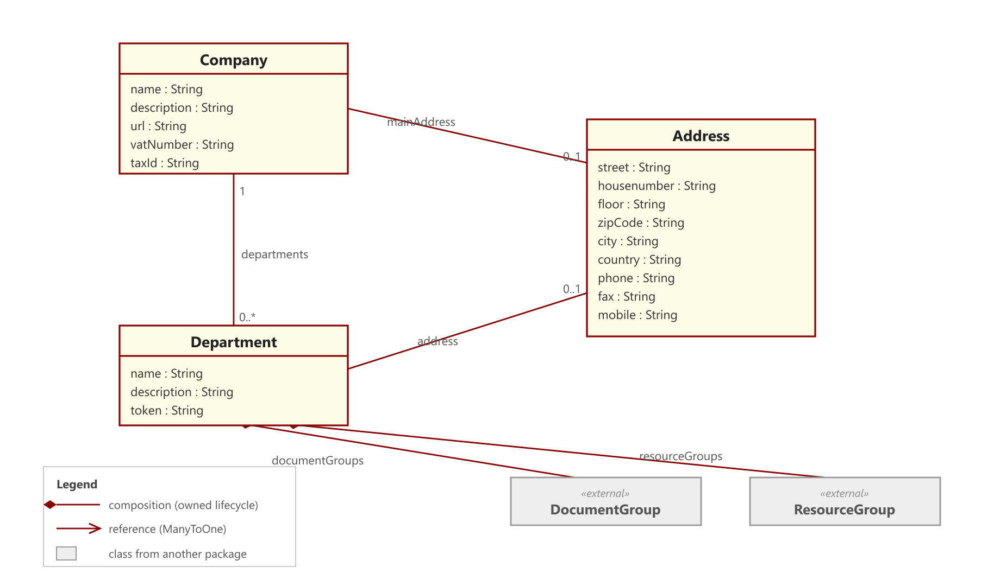

**Users, roles & permissions**

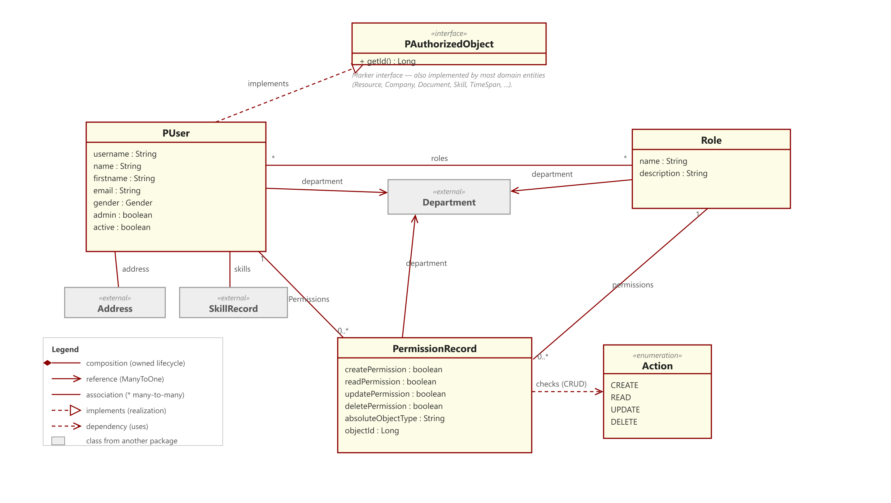

### Content & knowledge

**Documents (versioning, check-in/out)**

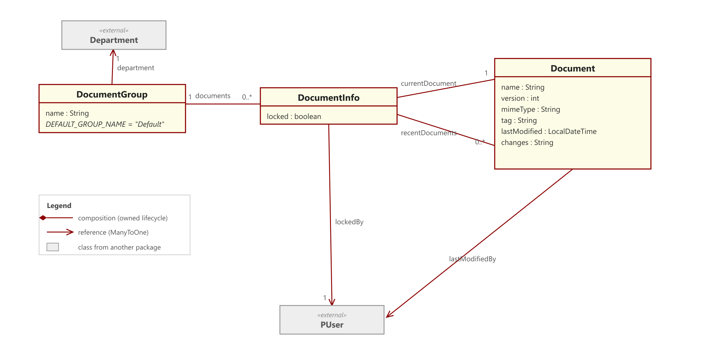

**Skills (for people and devices)**

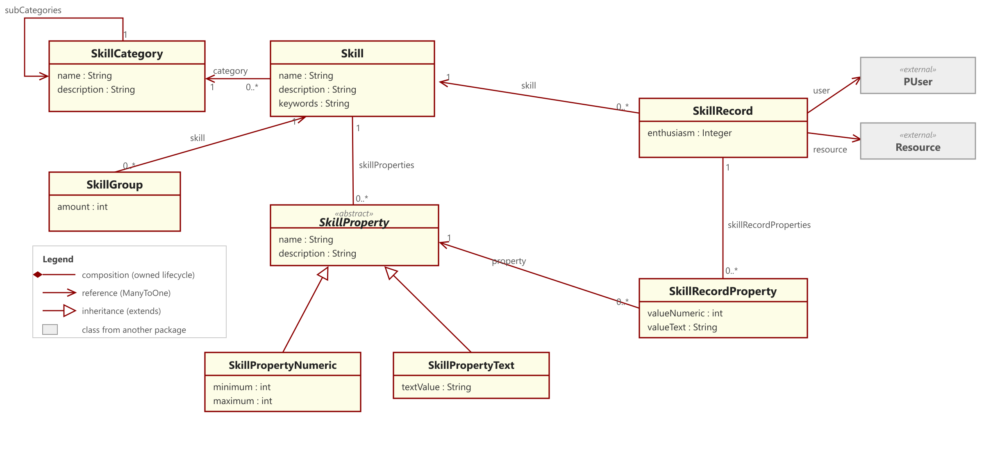

### Work & operations

**Projects, blackboards, tasks & goals**

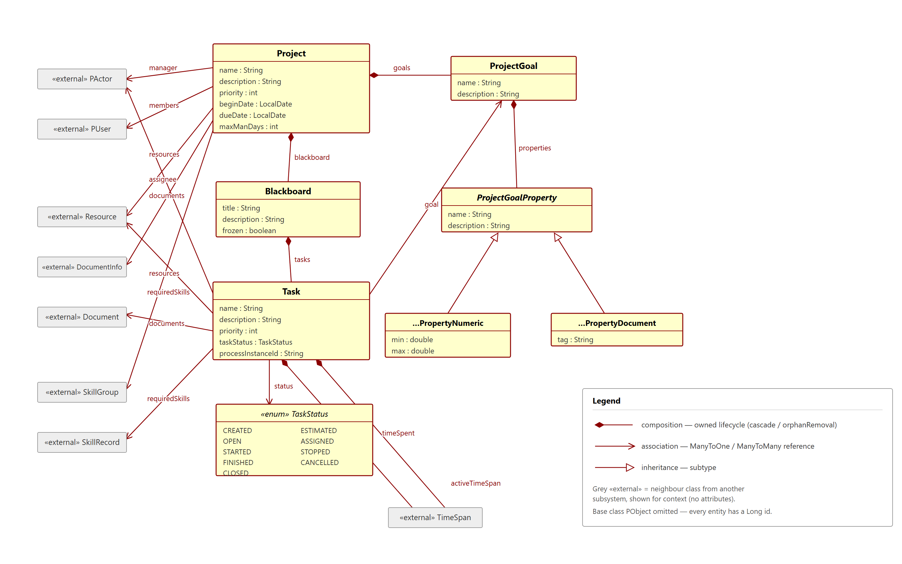

**Resources, reservations & control**

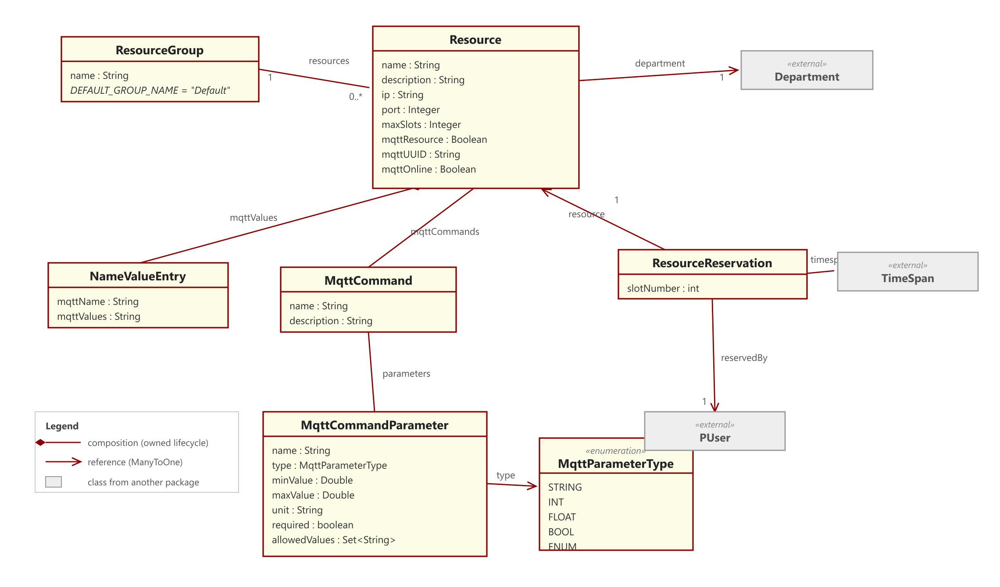

**Time spans (reservations & time tracking)**

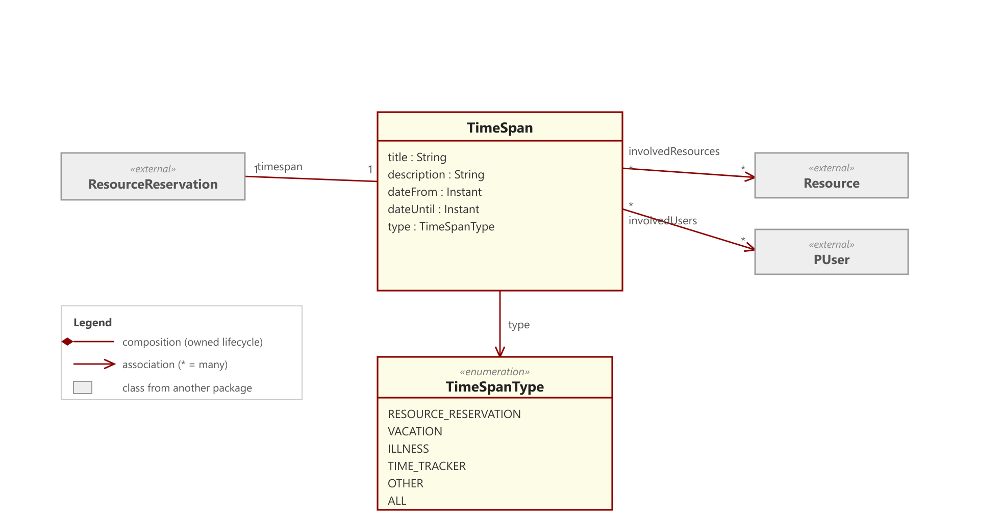

### Platform, IoT & automation

**Telemetry monitoring rules**

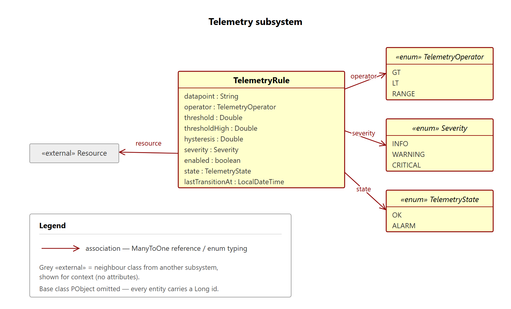

**Recurring task schedules**

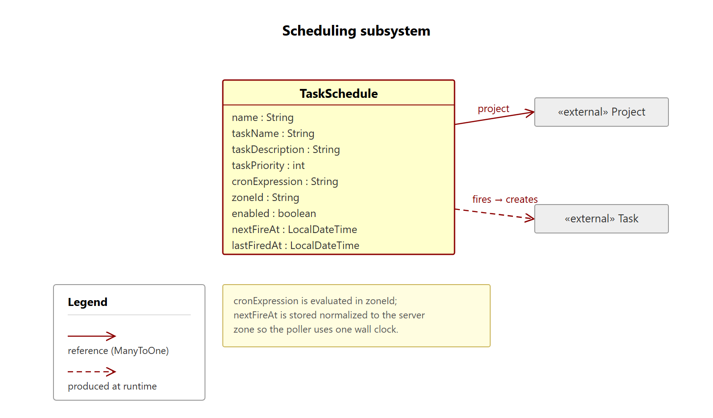

**BPMN process orchestration (Flowable)**

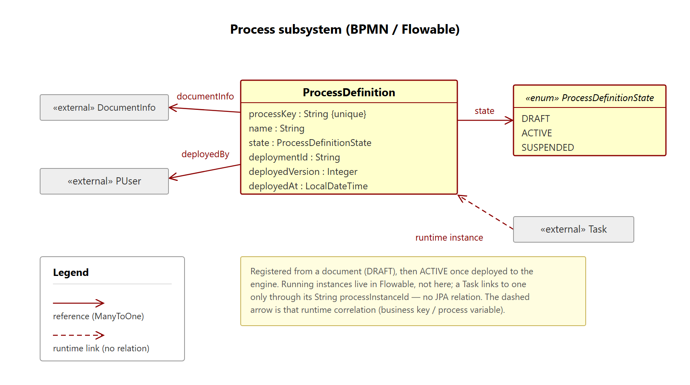

**NFC tags as physical triggers**

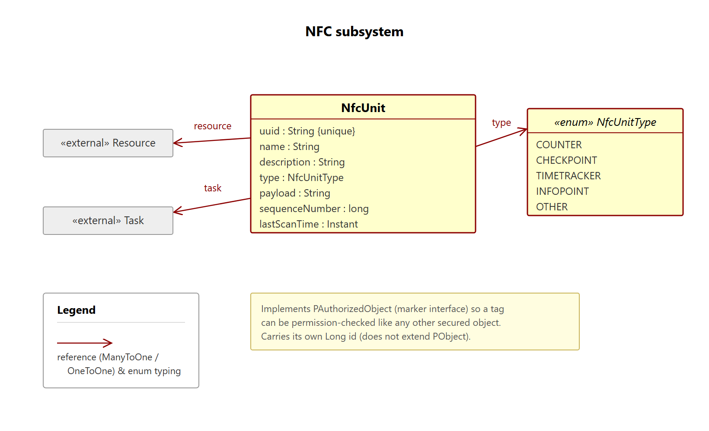

</details>

---

## Contributing

Pull requests are welcome. For major changes, please open an issue first to discuss the direction.

See **[CONTRIBUTING.md](CONTRIBUTING.md)** for how to build, test and submit changes (branch
model, commit conventions, code style, API-stability rules). Please also read our
[Code of Conduct](CODE_OF_CONDUCT.md). For security issues, follow the [Security Policy](SECURITY.md)
— do not open a public issue.

## License

Apache License 2.0 — see [LICENSE](LICENSE). Source files carry the corresponding Apache 2.0 headers.
